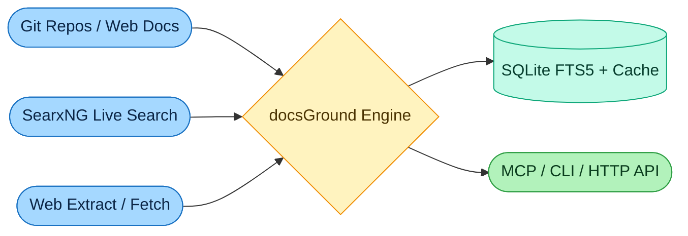

# docsGround ⚡

> Real-time grounding & documentation engine for AI agents. Stops hallucinations via Git docs indexing, SearxNG live meta-search, and clean markdown extraction.

---

## 🏗️ Architecture

---

## 🎯 Core Modules

1. **Docs Ingestion (`docs`)**
   - Direct Git clone (`--depth 1`) / raw GitHub markdown extraction.
   - Clean doc site scraping without HTML bloat.
   - SQLite FTS5 instant keyword and symbol search.

2. **Live Search (`search`)**
   - Embedded / connected SearxNG client.
   - Aggregates multi-engine real-time web results.

3. **Web Extract (`extract`)**
   - High-signal markdown cleaner (strips cookie bars, nav, JS noise).
   - Fast URL content fetcher for direct web grounding.

4. **Universal Interface**
   - Standard Model Context Protocol (MCP) server.
   - Standalone CLI & HTTP endpoint.
