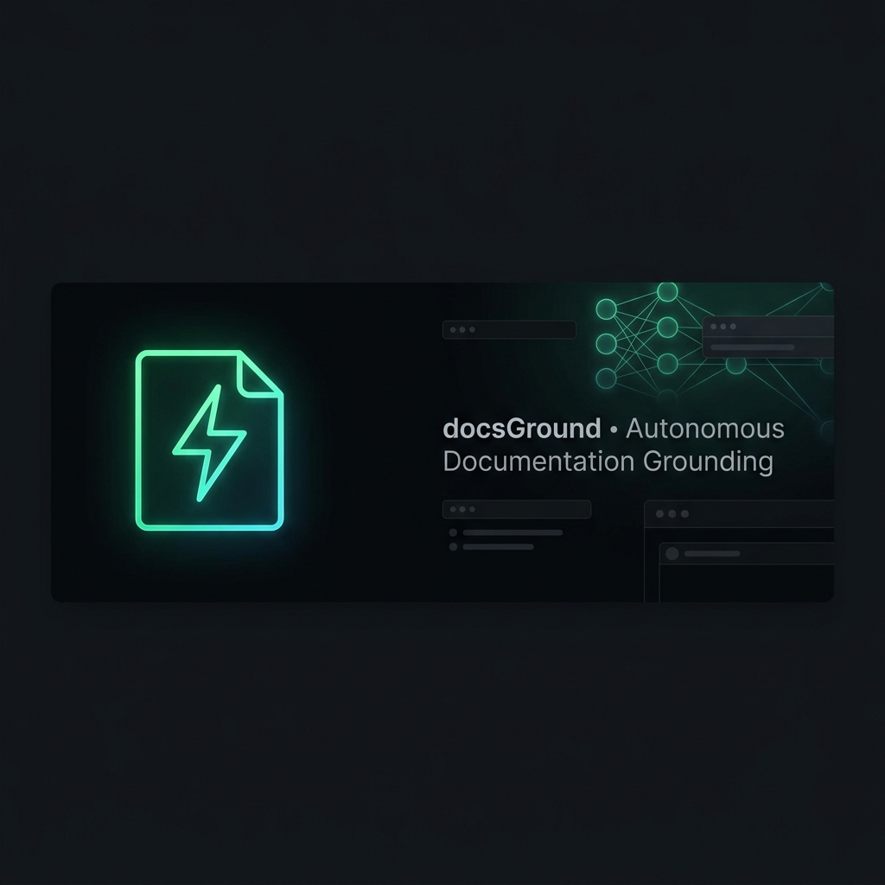
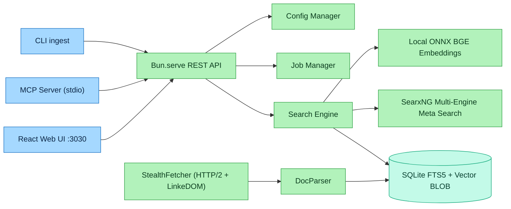

<div align="center">
  

  <br/><br/>

  
  <h1>docsGround</h1>
  <p><strong>Universal Documentation Grounding & High-Speed Search Engine for AI Coding Agents</strong></p>
  <p>
    <a href="#features">Features</a> •
    <a href="#quick-start">Quick Start</a> •
    <a href="#mcp-tools">MCP Tools</a> •
    <a href="#architecture">Architecture</a> •
    <a href="#rest-api">REST API</a>
  </p>
  <p>
    
    
    
    
  </p>
</div>

---

## Why docsGround?

AI models hallucinate when coding with modern or rapidly evolving libraries. Traditional docs MCP servers are slow, require bloated Python environments or heavy headless browsers, and consume massive cloud resources.

**docsGround** solves this by delivering an ultra-fast, zero-cloud, fully self-hosted documentation grounding stack running on **Bun + SQLite FTS5 + Local ONNX BGE Embeddings**.

- **1.4s Deep Crawl**: HTTP/2 AST crawler indexes hundreds of pages in seconds (no Playwright overhead).
- **Hybrid Retrieval**: BM25 exact symbol matching combined with 384-dimensional dense semantic vectors.
- **100% Offline & Private**: Built-in quantized BGE-Small ONNX vectorizer running locally on CPU.
- **Live Web Hybrid Fallback**: Auto-queries DuckDuckGo & Brave for queries outside the local index.
- **Notion-Style UI**: Modern dark dashboard with per-library Markdown readers and live background progress cards.
- **Autonomous Agent MCP Suite**: 8 native MCP tools allowing AI agents to self-serve, index, and manage docs.

---

## Quick Start

Requires [Bun](https://bun.sh) 1.3+.

```bash
git clone https://github.com/youssefvdel/docsGround.git
cd docsGround
bun install

# Start the Web UI + REST API (default port 3030)
bun run src/index.ts serve

# Run as a Stdio MCP server (default mode)
bun run src/index.ts mcp

# Ingest a library from the CLI
bun run src/index.ts ingest tauri https://docs.rs/tauri/latest/tauri/
```

Open **`http://localhost:3030`** (or your LAN IP `http://192.168.x.x:3030`) in your browser.

### Embedding model

The default embedding provider is the **built-in local ONNX BGE-Small model** — fully offline, zero API cost, ~15ms per document. You can switch to a remote OpenAI-compatible gateway from the UI (Settings → Embedding Provider), e.g. `http://127.0.0.1:20128/v1`.

---

## Autonomous MCP Tool Suite

| Tool | Description |
|---|---|
| `search_docs` | Hybrid dense vector + BM25 FTS5 exact symbol search with live web fallback |
| `scrape_and_index` | Deep crawl docs.rs, GitHub repos, or web manuals into the vector database |
| `web_search` | Real-time multi-engine meta-search (DuckDuckGo, Brave, GitHub) |
| `web_extract` | Clean Markdown extractor from any live webpage |
| `fetch_doc` | Retrieve exact full page text and symbol definitions by document ID |
| `list_libraries` | List all indexed documentation libraries and page counts |
| `delete_library` | Delete a library and cascade-clean its vectors |
| `rename_library` | Rename an indexed library collection |

### Register with an MCP client

```json
{
  "mcpServers": {
    "docsground": {
      "command": "bun",
      "args": ["run", "/absolute/path/to/docsGround/src/index.ts", "mcp"]
    }
  }
}
```

---

## Architecture



---

## REST API Reference

- `GET /api/search?q=<query>&library=<lib>&limit=10` — Hybrid semantic + FTS5 search with live-web fallback.
- `GET /api/libraries` — List all indexed libraries and page counts.
- `GET /api/library-docs?library=<lib>` — List all document paths for a library.
- `GET /api/doc?id=<doc_id>` — Fetch one indexed document's full content.
- `POST /api/ingest` — Trigger background non-blocking documentation indexing with live progress tracking.
- `GET /api/jobs` — Poll active and completed ingestion tasks with progress percentage.
- `GET /api/config` / `POST /api/config` — View and update runtime configuration.
- `POST /api/web-search` — Live multi-engine meta-search.
- `POST /api/extract` — Fetch any URL and convert to clean Markdown.

---

## Development

```bash
bun test        # run the test suite
bun run src/index.ts serve   # local dev server
```

Configuration lives in `~/.docsground/config.json` (created automatically on first run).

---

## License
MIT © 2026 docsGround Contributors
